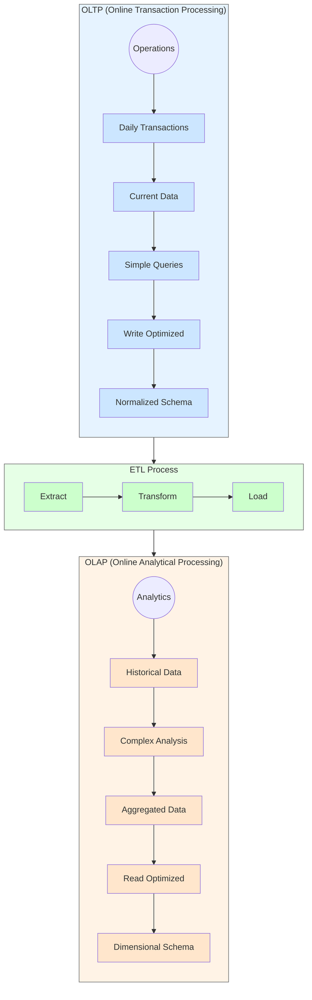

Let me explain the key differences between OLTP (Online Transaction Processing) and OLAP (Online Analytical Processing) systems.

OLTP systems are designed for day-to-day transactions and operational tasks:
- They handle many small, fast transactions (like processing orders or updating inventory)
- Data is current and constantly updated
- They focus on maintaining data consistency during concurrent access
- Database design is typically normalized to avoid redundancy
- Queries are simple and predefined, usually affecting only a few records
- Examples: Point-of-sale systems, ATMs, e-commerce platforms

OLAP systems are built for complex analysis and business intelligence:
- They process large amounts of historical data for analysis and reporting
- Data is periodically updated (not real-time)
- They use denormalized schemas (like star or snowflake) for faster querying
- Complex queries analyze trends across multiple dimensions
- Often include aggregated data and summaries
- Examples: Business intelligence dashboards, data warehouses, financial analysis systems

The main architectural differences include:

Storage:
- OLTP: Uses detailed, current data in normalized tables
- OLAP: Uses aggregated, historical data in dimensional models

Performance optimization:
- OLTP: Optimized for write operations and concurrent transactions
- OLAP: Optimized for read operations and complex queries

Data volume:
- OLTP: Gigabytes of operational data
- OLAP: Terabytes to petabytes of historical data

A typical workflow often involves OLTP systems capturing day-to-day transactions, which are then periodically loaded into OLAP systems for analysis through an ETL (Extract, Transform, Load) process.

