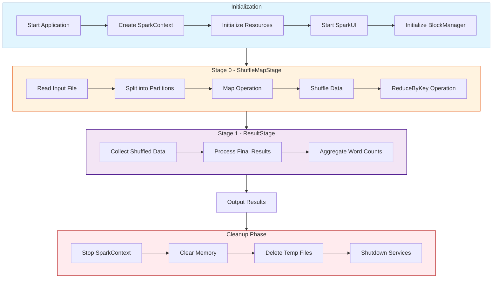
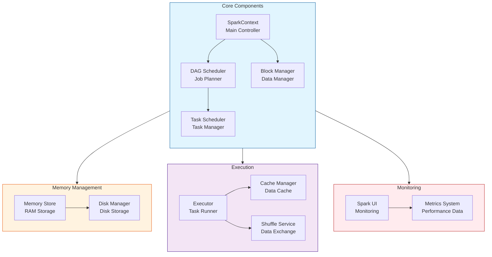
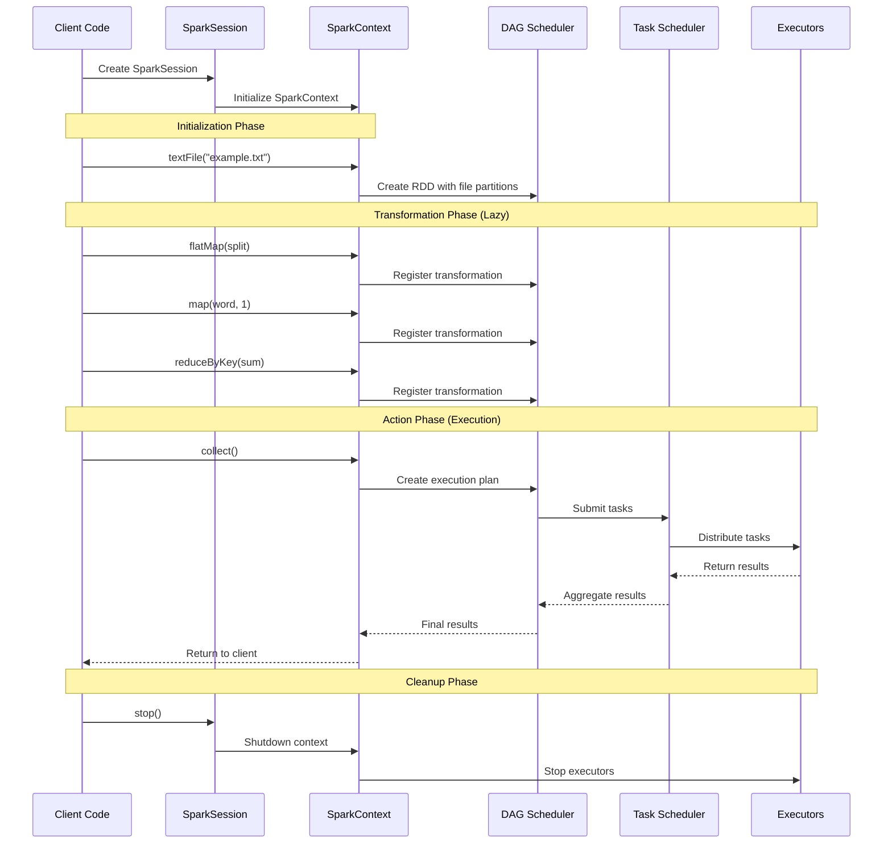
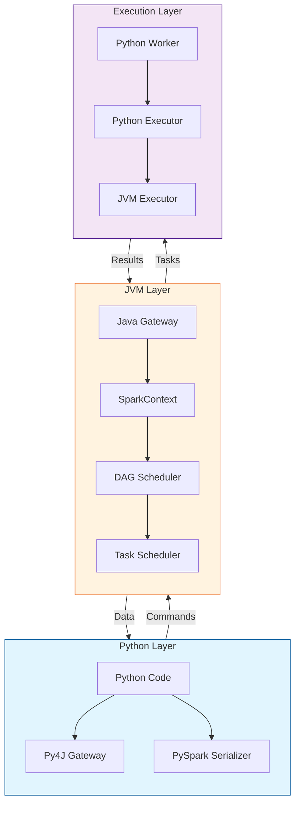
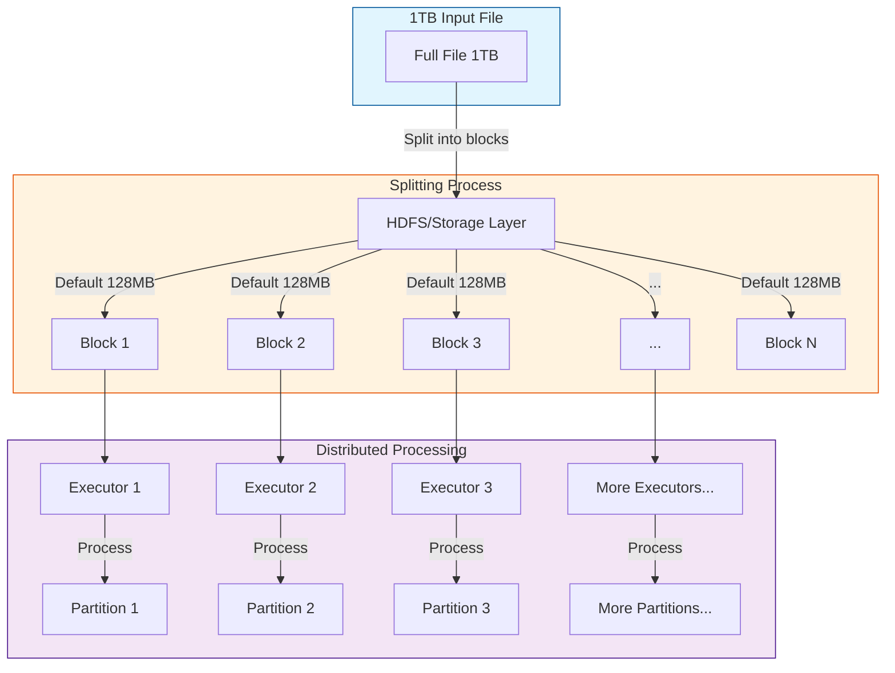

# Apache Spark


map-reduce architecture

- spark shuffle architecture
https://0x0fff.com/spark-architecture-shuffle/
https://medium.com/@ongchengjie/different-types-of-spark-join-strategies-997671fbf6b0


https://www.oreilly.com/library/view/data-algorithms-with/9781492082378/ch01.html


I'll break down how PySpark executes this word count program step by step based on the logs.

1. **Initial Setup and Configuration**
   - The program starts with Spark version 3.5.4 on MacOS (aarch64)
   - Java version 17.0.14 is being used
   - A SparkContext is created with the application name "Word Count Example"
   - Memory allocation: MemoryStore started with 434.4 MiB capacity

2. **Resource and Service Initialization**
   - SparkUI is started on port 4040
   - BlockManager is initialized for managing distributed data blocks
   - An executor is started on the local machine (192.168.1.110)
   - Network services are initialized (NettyBlockTransferService on port 62206)

3. **Job Execution Flow**
   The word count job is broken down into stages:

   a) **Stage 0 (ShuffleMapStage)**
   - Input: The program reads from "example.txt"
   - Operation: reduceByKey operation is performed
   - Partitions: Data is split into 2 partitions
   - Duration: Completed in 0.604 seconds
   
   b) **Stage 1 (ResultStage)**
   - Collects the reduced results
   - Also runs with 2 tasks
   - Duration: Completed in 0.071 seconds

4. **Data Processing**
   - The input file is split into two partitions for parallel processing
   - Each partition is processed by separate tasks
   - The program performs:
     - Text file reading
     - Word splitting
     - Word counting using reduceByKey
     - Final collection of results

5. **Results**
   - The output shows word frequencies (e.g., "Lorem: 4", "the: 6", etc.)
   - Total job completion time: 0.696380 seconds

6. **Resource Management**
   - Uses a shuffle system (warning about psutil for better spilling support)
   - Manages memory blocks for broadcasting data
   - Handles task scheduling and distribution

7. **Cleanup**
   - SparkContext is stopped
   - Memory is cleared
   - Temporary directories are deleted
   - All services (UI, BlockManager, etc.) are shut down

Key Components Used:
1. **SparkContext**: The main entry point for Spark functionality
2. **DAGScheduler**: Handles job scheduling and breaking work into stages
3. **TaskScheduler**: Manages individual task execution
4. **BlockManager**: Handles data block storage and distribution
5. **MemoryStore**: Manages in-memory storage of data
6. **Executor**: Performs the actual task execution
7. **ShuffleMapStage**: Handles data redistribution between stages
8. **ResultStage**: Collects and aggregates final results

The entire process demonstrates Spark's distributed computing model, even when running locally, showing how it breaks down a simple word count problem into parallel tasks for efficient processing.




This diagram illustrates the main phases of PySpark execution for the word count problem:

1. **Initialization Phase**:
   - Application startup
   - SparkContext creation
   - Resource initialization
   - UI and BlockManager setup

2. **Stage 0 (ShuffleMapStage)**:
   - File reading
   - Data partitioning
   - Initial mapping
   - Data shuffling
   - Reduction operations

3. **Stage 1 (ResultStage)**:
   - Collection of shuffled data
   - Final processing
   - Word count aggregation

4. **Cleanup Phase**:
   - SparkContext shutdown
   - Memory cleanup
   - Temporary file deletion
   - Service shutdown




I'll explain each component and its purpose in detail for a beginner's understanding.


Let me explain each component in detail:

1. **Core Components**

   a) **SparkContext (The Brain)**
   - What it does: Acts as the main entry point for your PySpark program
   - Why it's needed: 
     - Creates and manages all other components
     - Holds configuration settings
     - Controls the overall lifecycle of your Spark application
   - In your logs: `SparkContext: Running Spark version 3.5.4`

   b) **DAG Scheduler (The Planner)**
   - What it does: Converts your code into a series of steps (like a recipe)
   - Why it's needed:
     - Breaks down complex operations into simple steps
     - Optimizes the order of operations
     - Determines what can be done in parallel
   - In your logs: `DAGScheduler: Job 0 finished: collect at wordcount.py:17`

   c) **Task Scheduler (The Coordinator)**
   - What it does: Assigns work to available workers
   - Why it's needed:
     - Distributes tasks fairly
     - Tracks task completion
     - Handles failures
   - In your logs: `TaskSchedulerImpl: Adding task set 0.0 with 2 tasks`

2. **Memory Management**

   a) **Memory Store (The RAM)**
   - What it does: Stores data in memory for fast access
   - Why it's needed:
     - Provides fast data access
     - Caches frequently used data
     - Reduces disk operations
   - In your logs: `MemoryStore started with capacity 434.4 MiB`

   b) **Block Manager (The Librarian)**
   - What it does: Manages how data is stored and accessed
   - Why it's needed:
     - Tracks data locations
     - Manages data transfers
     - Handles data persistence
   - In your logs: `BlockManager: Initialized BlockManager`

3. **Execution Components**

   a) **Executor (The Worker)**
   - What it does: Actually runs the tasks
   - Why it's needed:
     - Processes data
     - Runs computations
     - Reports results
   - In your logs: `Executor: Running task 0.0 in stage 0.0`

   b) **Shuffle Service (The Post Office)**
   - What it does: Moves data between different executors
   - Why it's needed:
     - Enables data sharing
     - Supports operations like groupBy, join
     - Handles data redistribution
   - In your logs: `ShuffleBlockFetcherIterator: Getting 1 non-empty blocks`

4. **Monitoring and UI**

   a) **Spark UI (The Dashboard)**
   - What it does: Provides web interface to monitor your application
   - Why it's needed:
     - Shows progress
     - Helps debugging
     - Provides performance metrics
   - In your logs: `SparkUI: Started Spark web UI at http://192.168.1.110:4040`

For your specific word count example, here's what happens:

1. **Reading Phase**
```
Input File -> SparkContext reads -> Splits into partitions
```
- Your text file is read
- Split into chunks for parallel processing

2. **Processing Phase**
```
Words -> Map (count) -> Shuffle (group) -> Reduce (sum)
```
- Each word is mapped to (word, 1)
- Similar words are grouped
- Counts are summed up

3. **Result Phase**
```
Results -> Collect -> Output
```
- Final counts are gathered
- Results are displayed

The logs you see are these components talking to each other and reporting their status. Think of it like a kitchen where:
- SparkContext is the head chef
- DAG Scheduler is the recipe planner
- Task Scheduler is the kitchen manager
- Executors are the cooks
- Memory Store is the prep area
- Block Manager is the pantry manager
- Shuffle Service is the kitchen porter moving ingredients around

This organization allows Spark to process large amounts of data efficiently, even when the data is too big to fit on one computer.



I'll explain the execution flow of each line and how Spark handles it in detail.


Let's break down each line and its execution:

1. **SparkSession Initialization**
```python
spark = SparkSession.builder.appName("Word Count Example").getOrCreate()
```
- What happens:
  - Creates a SparkSession (new interface) or gets existing one
  - Initializes SparkContext (core engine)
  - Sets up internal services (UI, Block Manager, etc.)
  - Prepares execution environment
- Where it runs: Client machine initially, then coordinates with cluster

2. **Text File Reading**
```python
text_file = spark.sparkContext.textFile("example.txt")
```
- What happens:
  - Creates an RDD (Resilient Distributed Dataset)
  - Divides file into partitions (blocks)
  - NO ACTUAL READING YET (lazy evaluation)
- Where:
  - Planning happens on driver
  - Actual reading happens later on executors
  - Default partition size is 128MB

3. **Transformations**
```python
word_counts = text_file.flatMap(lambda line: line.split(" ")) \
    .map(lambda word: (word, 1)) \
    .reduceByKey(lambda a, b: a + b)
```
Each transformation is planned but NOT executed yet (lazy evaluation):

a) **flatMap**:
- What: Splits each line into words
- Where: Planned on driver, executed later on executors
- How: Creates new RDD transformation plan

b) **map**:
- What: Converts each word to (word, 1) pair
- Where: Planned on driver, executed later on executors
- How: Adds to transformation plan

c) **reduceByKey**:
- What: Sums counts for each word
- Where: Planned on driver, involves shuffle between executors
- How: Adds final transformation to plan

4. **Action (collect)**
```python
for word, count in word_counts.collect():
```
This triggers actual execution:
1. DAG Scheduler creates execution plan
2. Breaks job into stages
3. Creates tasks for each partition
4. Task Scheduler distributes tasks
5. Executors:
   - Read file partitions
   - Apply transformations
   - Perform shuffles
   - Return results

5. **Cleanup**
```python
spark.stop()
```
- Shuts down SparkContext
- Stops executors
- Cleans up resources
- Closes connections

**How Spark Creates Multiple Executor Nodes:**

1. **Local Mode:**
- Single JVM
- Simulates parallel execution
- Default for testing

2. **Standalone Cluster:**
```
Master Node
├── Driver Program
└── Worker Nodes
    ├── Executor 1
    │   └── Tasks
    ├── Executor 2
    │   └── Tasks
    └── Executor N
        └── Tasks
```

3. **Resource Allocation:**
- Specified in configuration
  ```python
  spark = SparkSession.builder \
      .config("spark.executor.instances", "3") \
      .config("spark.executor.cores", "2") \
      .config("spark.executor.memory", "2g") \
      .getOrCreate()
  ```

4. **Executor Creation Process:**
- SparkContext requests resources from cluster manager
- Cluster manager finds available nodes
- Worker nodes launch executors
- Executors register with driver
- Driver tracks executor status

5. **Task Distribution:**
- Each executor gets multiple tasks
- Tasks run in parallel within executor
- Data locality is considered
- Failed tasks are retried

This is how a single line of Python code translates into a distributed computation across multiple machines, with Spark handling all the complexity of distribution, fault tolerance, and data movement.



Let me explain how Python code gets transformed into Spark's execution plan.


Let's break down how Python code becomes a Spark execution plan:

1. **Python to JVM Bridge**
   ```python
   spark = SparkSession.builder.appName("Example").getOrCreate()
   ```
   What happens:
   - Python code uses Py4J to communicate with JVM
   - Py4J creates a gateway server
   - Commands are translated to Java calls
   - A JVM is started to run Spark's core engine

2. **RDD Creation and Operations**
   ```python
   rdd = spark.sparkContext.textFile("file.txt")
   ```
   Process:
   - Python creates RDD reference
   - RDD operations are recorded as transformations
   - Each operation becomes part of DAG (Directed Acyclic Graph)
   - No actual execution yet (lazy evaluation)

3. **Python Function Translation**
   ```python
   mapped_rdd = rdd.map(lambda x: x.split())
   ```
   Steps:
   a) Function Serialization:
   - Python lambda is serialized
   - Sent to worker nodes
   - Stored for distributed execution

   b) Function Registration:
   - Function gets unique ID
   - Added to transformation pipeline
   - Tracked by SparkContext

4. **Execution Planning**
   When an action is called (like .collect()):

   ```plaintext
   Python Code → DAG → Stages → Tasks
   ```

   Example transformation:
   ```python
   # Python code
   word_counts = text_file.flatMap(lambda x: x.split()) \
                         .map(lambda x: (x, 1)) \
                         .reduceByKey(lambda x,y: x+y)
   ```
   Becomes:
   ```plaintext
   Stage 1: (Read) → (FlatMap) → (Map)
   Stage 2: (Shuffle) → (ReduceByKey)
   ```

5. **Python Worker Process**
   For each executor:
   ```plaintext
   JVM Executor → Python Process → Data Processing
   ```
   - JVM reads data
   - Sends to Python worker
   - Python executes functions
   - Results return to JVM

Here's a detailed example:

```python
# 1. Python Code
text_rdd = sc.textFile("file.txt")
words = text_rdd.flatMap(lambda x: x.split())
pairs = words.map(lambda x: (x, 1))
counts = pairs.reduceByKey(lambda x, y: x + y)

# 2. Internal Translation
class PythonRDD:
    def __init__(self, jrdd):
        self._jrdd = jrdd  # Java RDD reference
        
    def map(self, f):
        # Serialize Python function
        command = serialize_function(f)
        # Create new Java transformation
        new_jrdd = self._jrdd.mapToPair(command)
        # Return new Python RDD wrapper
        return PythonRDD(new_jrdd)
```

6. **Execution Flow**:
   ```plaintext
   1. Python → Py4J Gateway
   2. Gateway → JVM SparkContext
   3. SparkContext → DAG Scheduler
   4. DAG Scheduler → Task Scheduler
   5. Task Scheduler → Executors
   ```

7. **Data Flow**:
   ```plaintext
   1. JVM reads data chunk
   2. Data sent to Python worker
   3. Python processes data
   4. Results sent back to JVM
   5. JVM handles distribution
   ```

The key components that make this possible:

1. **Py4J**:
   - Bridges Python and Java
   - Handles command translation
   - Manages communication

2. **PySpark Serializer**:
   - Serializes Python functions
   - Converts Python data types
   - Handles data transfer

3. **Python Worker**:
   - Runs in separate process
   - Executes Python functions
   - Processes data chunks

4. **JVM Executor**:
   - Manages resources
   - Handles data distribution
   - Coordinates with Python worker

This architecture allows Python code to be distributed and executed efficiently across a cluster while maintaining Python's ease of use and Spark's powerful distributed computing capabilities.




Let me explain how Spark handles file splitting, especially for large files like 1TB.


Let's break down how Spark handles file splitting:

1. **Default Block Size**
   - Default block size: 128MB
   - For 1TB file: Approximately 8,192 blocks (1TB / 128MB)
   - Configurable through:
   ```python
   spark.conf.set("spark.sql.files.maxPartitionBytes", 134217728)  # 128MB in bytes
   ```

2. **Splitting Factors**
   a) **Block Size Determination**:
   - Based on storage system (HDFS, S3, etc.)
   - Input format type
   - File size
   - Available resources

   b) **Input Format Considerations**:
   - Text files: Split at line boundaries
   - Compressed files:
     - Splittable: bzip2
     - Non-splittable: gzip (must be read as single block)
   - Binary files: Raw byte-level splitting

3. **Configuration Options**
```python
# Configure minimum split size
spark.conf.set("spark.sql.files.minPartitionBytes", 1024*1024)  # 1MB

# Configure maximum split size
spark.conf.set("spark.sql.files.maxPartitionBytes", 256*1024*1024)  # 256MB

# Configure number of partitions
spark.conf.set("spark.sql.shuffle.partitions", 200)
```

4. **Splitting Process**
```plaintext
1TB File → Multiple 128MB Blocks → Distributed to Executors
```

Example code showing custom partition size:
```python
# For a 1TB file
spark = SparkSession.builder \
    .appName("Large File Processing") \
    .config("spark.sql.files.maxPartitionBytes", 256*1024*1024) \  # 256MB partitions
    .getOrCreate()

# Read with custom partition size
df = spark.read \
    .option("maxPartitionBytes", 256*1024*1024) \
    .text("path_to_1TB_file")
```

5. **Partition Allocation**
- Each executor gets multiple partitions
- Data locality is considered (try to process data where it resides)
- Memory constraints are respected

6. **Memory Management**
For 1TB file:
```python
# Recommended memory settings
spark.conf.set("spark.executor.memory", "8g")  # Executor memory
spark.conf.set("spark.driver.memory", "4g")    # Driver memory
spark.conf.set("spark.memory.fraction", 0.8)   # Memory fraction for execution
```

7. **Best Practices for Large Files**

```python
# Optimal configuration for 1TB file
spark = SparkSession.builder \
    .appName("Large File Processing") \
    .config("spark.executor.memory", "8g") \
    .config("spark.executor.cores", "4") \
    .config("spark.executor.instances", "50") \
    .config("spark.sql.files.maxPartitionBytes", 256*1024*1024) \
    .config("spark.sql.shuffle.partitions", "200") \
    .getOrCreate()

# Reading with optimizations
df = spark.read \
    .option("maxPartitionBytes", 256*1024*1024) \
    .option("inferSchema", "true") \
    .option("header", "true") \
    .csv("path_to_1TB_file")
```

8. **Common Issues and Solutions**
- Out of Memory: Increase number of partitions
- Slow Processing: Adjust partition size
- Skewed Data: Use custom partitioning
- Network Bottleneck: Consider data locality

For your 1TB file:
1. It will be split into ~8,192 blocks (with default 128MB size)
2. Each block becomes a task
3. Tasks are distributed across available executors
4. Each executor processes multiple blocks in parallel

To monitor the splitting and processing:
```python
# Get number of partitions
print(f"Number of partitions: {df.rdd.getNumPartitions()}")

# Get partition sizes
partition_sizes = df.rdd.mapPartitions(lambda x: [sum(1 for _ in x)]).collect()
for i, size in enumerate(partition_sizes):
    print(f"Partition {i}: {size} records")
```

This helps you understand and optimize how your large file is being processed across the cluster.

## how splited data get transferred to Executor node via network?

```bash
flowchart TD
    subgraph Input["1TB Input File"]
        F[Full File 1TB]
    end

    subgraph Splitting["Splitting Process"]
        direction TB
        H[HDFS/Storage Layer] -->|Default 128MB| B[Block 1]
        H -->|Default 128MB| B2[Block 2]
        H -->|Default 128MB| B3[Block 3]
        H -->|...| B4[...]
        H -->|Default 128MB| B5[Block N]
    end

    subgraph Processing["Distributed Processing"]
        direction TB
        E1[Executor 1] -->|Process| P1[Partition 1]
        E2[Executor 2] -->|Process| P2[Partition 2]
        E3[Executor 3] -->|Process| P3[Partition 3]
        E4[More Executors...] -->|Process| P4[More Partitions...]
    end

    F -->|Split into blocks| H
    B --> E1
    B2 --> E2
    B3 --> E3
    B4 --> E4

    style Input fill:#e1f5fe,stroke:#01579b
    style Splitting fill:#fff3e0,stroke:#e65100
    style Processing fill:#f3e5f5,stroke:#4a148c
```
Let me explain how Spark transfers split data to executor nodes across the network.


Let's break down the data transfer process:

1. **Network Transfer Components**
   - **BlockManager**: Coordinates data block transfers
   - **NettyBlockTransferService**: Handles network communication
   - **ShuffleClient**: Manages shuffle data movement
   - **NioEventLoop**: Manages network I/O events

2. **Data Transfer Process**
```plaintext
Step 1: Block Location Discovery
↓
Step 2: Connection Establishment
↓
Step 3: Data Streaming
↓
Step 4: Reception and Processing
```

3. **Key Transfer Mechanisms**

   a) **Direct Transfer**
   ```python
   # Example configuration for direct transfer
   spark.conf.set("spark.block.transfer.protocol", "netty")
   spark.conf.set("spark.shuffle.io.maxRetries", 3)
   spark.conf.set("spark.shuffle.io.retryWait", "5s")
   ```

   b) **Shuffle Transfer**
   ```python
   # Configure shuffle service
   spark.conf.set("spark.shuffle.service.enabled", True)
   spark.conf.set("spark.shuffle.service.port", 7337)
   ```

4. **Network Optimizations**

   a) **Compression**
   ```python
   # Enable compression
   spark.conf.set("spark.shuffle.compress", True)
   spark.conf.set("spark.shuffle.spill.compress", True)
   ```

   b) **Batch Size**
   ```python
   # Configure batch size for network transfers
   spark.conf.set("spark.shuffle.io.preferDirectBufs", True)
   spark.conf.set("spark.shuffle.file.buffer", "64k")
   ```

5. **Data Transfer Flow**:
   ```plaintext
   Source Node                    Target Node
   ───────────                    ───────────
   1. Read Block                  
   2. Serialize    ───────►      3. Receive Data
   4. Compress                    5. Decompress
                                 6. Deserialize
                                 7. Process
   ```

6. **Network Protocol Details**

   a) **Block Transfer Protocol**
   - Uses Netty for async I/O
   - Implements custom RPC protocol
   - Handles chunked transfers

   b) **Reliability Features**
   - Automatic retry logic
   - Failure detection
   - Connection pooling

7. **Data Locality Optimization**
```python
# Configure locality wait
spark.conf.set("spark.locality.wait", "3s")
spark.conf.set("spark.locality.wait.process", "3s")
spark.conf.set("spark.locality.wait.node", "3s")
```

8. **Security in Transfer**
```python
# Enable encryption
spark.conf.set("spark.network.crypto.enabled", True)
spark.conf.set("spark.network.crypto.keyLength", 128)
```

9. **Monitoring Transfer**
```python
# Access metrics
spark.sparkContext.statusTracker().getExecutorInfos()
```

10. **Common Network Issues and Solutions**

    a) **Network Congestion**
    ```python
    # Adjust network timeout
    spark.conf.set("spark.network.timeout", "800s")
    spark.conf.set("spark.storage.blockManagerSlaveTimeoutMs", "300s")
    ```

    b) **Memory Pressure**
    ```python
    # Configure memory for transfers
    spark.conf.set("spark.memory.offHeap.enabled", True)
    spark.conf.set("spark.memory.offHeap.size", "10g")
    ```

11. **Transfer Stages**:
```
1. Initial Request
   ├── Block location lookup
   └── Connection initialization

2. Data Transfer
   ├── Chunk serialization
   ├── Network streaming
   └── Chunk assembly

3. Processing
   ├── Deserialization
   ├── Validation
   └── Execution
```

12. **Performance Monitoring**
```python
# Monitor network metrics
def monitor_transfer():
    metrics = spark._jvm.org.apache.spark.metrics.MetricsSystem
    transfer_metrics = metrics.getInstance().getSourcesByName("BlockManager")
    return transfer_metrics[0].metricRegistry().getMetrics()
```

The data transfer process is crucial for Spark's distributed computing model. It uses:
- Efficient network protocols
- Data compression
- Smart locality preferences
- Fault tolerance mechanisms
- Optimized buffering
- Security measures

All these components work together to ensure reliable and efficient data movement between nodes in your Spark cluster.