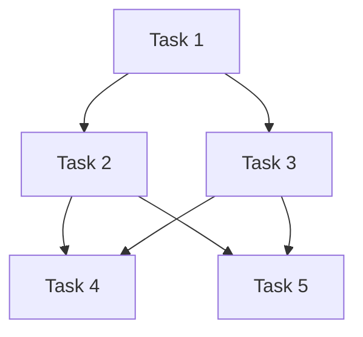

# Apache Airflow

Apache Airflow is like a smart calendar or task scheduler for your data and software operations, but much more powerful. Let me break this down:

What is Airflow?
- It's an open-source platform that helps you schedule and manage complex sequences of computer tasks
- Think of it like a recipe book that not only contains the steps but also automatically executes them in the right order at the right time

Where is it used?
- Data companies like Airbnb (who actually created it), Twitter, and Facebook
- Any organization that needs to process data regularly
- Companies that need to run multiple tasks in a specific order

Why is it used?
- Imagine you're running a bakery and every morning you need to:
  1. Check inventory
  2. Order ingredients
  3. Prepare dough
  4. Bake bread
  5. Update sales records

You can't bake before preparing dough, and you can't prepare dough without ingredients. Airflow helps manage these dependencies automatically but for data tasks.

Real-world examples:
1. Processing daily sales data:
   - Download data from stores
   - Clean the data
   - Generate reports
   - Send emails to managers

2. Machine Learning workflows:
   - Collect new data
   - Train models
   - Deploy updated models
   - Monitor performance

Problems it solves:
1. Task Dependencies: Makes sure tasks run in the correct order
2. Retries: Automatically retries failed tasks
3. Monitoring: Shows you what's running, what failed, and what succeeded
4. Scheduling: Runs tasks at specific times or intervals
5. Scalability: Can handle many tasks running at once

Think of it this way: If you had to manually run 20 different programs in a specific order every day at 3 AM, it would be impossible. Airflow does this automatically and reliably.

## simple example of an Airflow task (we call it a DAG - Directed Acyclic Graph) that processes some data daily.

```python
from airflow import DAG
from airflow.operators.python_operator import PythonOperator
from datetime import datetime, timedelta

# Define the default arguments for our DAG
default_args = {
    'owner': 'me',
    'start_date': datetime(2024, 2, 7),
    'retries': 1,  # If task fails, try 1 more time
    'retry_delay': timedelta(minutes=5)  # Wait 5 minutes before retry
}

# Create the DAG
dag = DAG(
    'my_first_dag',  # Name of your DAG
    default_args=default_args,
    schedule_interval='@daily'  # Run once every day
)

# Define some example functions
def get_data():
    print("Downloading data...")
    # Here you would add code to download data

def process_data():
    print("Processing data...")
    # Here you would add code to process data

def send_email():
    print("Sending email report...")
    # Here you would add code to send email

# Create the tasks
task1 = PythonOperator(
    task_id='get_data',
    python_callable=get_data,
    dag=dag
)

task2 = PythonOperator(
    task_id='process_data',
    python_callable=process_data,
    dag=dag
)

task3 = PythonOperator(
    task_id='send_email',
    python_callable=send_email,
    dag=dag
)

# Set the order of tasks
task1 >> task2 >> task3  # This means: task1 runs first, then task2, then task3
```

Let me break down what this code does:

1. First, we import the needed libraries
2. We set up some default settings (like when to start, what to do if something fails)
3. We create a DAG (our workflow) that runs daily
4. We define three simple tasks:
   - Download some data
   - Process that data
   - Send an email report
5. We set the order: task1 → task2 → task3

When this runs in Airflow, you'll see something like this in the Airflow web interface:
```
get_data → process_data → send_email
```

And Airflow will:
- Run this every day automatically
- Show you if any task fails
- Retry failed tasks
- Let you monitor everything through a web interface

The real power comes when your tasks get more complex, like:
- Downloading data from multiple sources
- Running complex transformations
- Training machine learning models
- Updating databases
- Generating multiple reports

## what is mean Directed Acyclic Graph?

A Directed Acyclic Graph (DAG) is a type of graph data structure that has two key properties:

1. Directed: All edges in the graph have a direction, meaning they point from one vertex to another. Think of them like one-way streets between locations.

2. Acyclic: There are no cycles or loops in the graph. If you start at any vertex and follow the directed edges, you can never return to where you started.




In this example, each node represents a task, and the arrows show dependencies between tasks. Some common real-world applications of DAGs include:

- Task scheduling: Dependencies between tasks in a project (like the diagram shows)
- Build systems: Compilation dependencies in software
- Workflow management: Business process modeling
- Version control: Git commit history
- Data processing pipelines: ETL (Extract, Transform, Load) workflows

Key characteristics:
- A DAG must have at least one vertex with no incoming edges (called a "source")
- It must also have at least one vertex with no outgoing edges (called a "sink")
- You can always "topologically sort" a DAG, meaning you can arrange the vertices in a linear order where all edges point forward

Would you like me to explain any specific aspect of DAGs in more detail?
