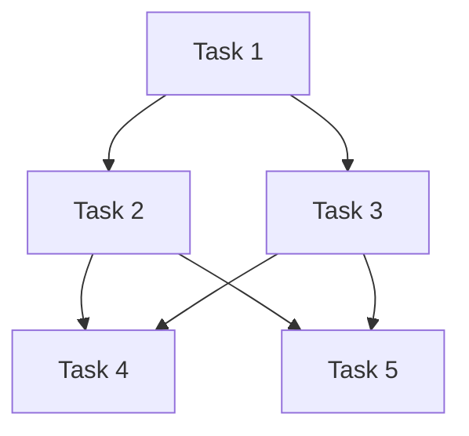

# Apache Airflow

Apache Airflow is like a smart calendar or task scheduler for your data and software operations, but much more powerful. Let me break this down:

What is Airflow?
- It's an open-source platform that helps you schedule and manage complex sequences of computer tasks
- Think of it like a recipe book that not only contains the steps but also automatically executes them in the right order at the right time

Where is it used?
- Data companies like Airbnb (who actually created it), Twitter, and Facebook
- Any organization that needs to process data regularly
- Companies that need to run multiple tasks in a specific order

Why is it used?
- Imagine you're running a bakery and every morning you need to:
  1. Check inventory
  2. Order ingredients
  3. Prepare dough
  4. Bake bread
  5. Update sales records

You can't bake before preparing dough, and you can't prepare dough without ingredients. Airflow helps manage these dependencies automatically but for data tasks.

Real-world examples:
1. Processing daily sales data:
   - Download data from stores
   - Clean the data
   - Generate reports
   - Send emails to managers

2. Machine Learning workflows:
   - Collect new data
   - Train models
   - Deploy updated models
   - Monitor performance

Problems it solves:
1. Task Dependencies: Makes sure tasks run in the correct order
2. Retries: Automatically retries failed tasks
3. Monitoring: Shows you what's running, what failed, and what succeeded
4. Scheduling: Runs tasks at specific times or intervals
5. Scalability: Can handle many tasks running at once

Think of it this way: If you had to manually run 20 different programs in a specific order every day at 3 AM, it would be impossible. Airflow does this automatically and reliably.

## simple example of an Airflow task (we call it a DAG - Directed Acyclic Graph) that processes some data daily.

```python
from airflow import DAG
from airflow.operators.python_operator import PythonOperator
from datetime import datetime, timedelta

# Define the default arguments for our DAG
default_args = {
    'owner': 'me',
    'start_date': datetime(2024, 2, 7),
    'retries': 1,  # If task fails, try 1 more time
    'retry_delay': timedelta(minutes=5)  # Wait 5 minutes before retry
}

# Create the DAG
dag = DAG(
    'my_first_dag',  # Name of your DAG
    default_args=default_args,
    schedule_interval='@daily'  # Run once every day
)

# Define some example functions
def get_data():
    print("Downloading data...")
    # Here you would add code to download data

def process_data():
    print("Processing data...")
    # Here you would add code to process data

def send_email():
    print("Sending email report...")
    # Here you would add code to send email

# Create the tasks
task1 = PythonOperator(
    task_id='get_data',
    python_callable=get_data,
    dag=dag
)

task2 = PythonOperator(
    task_id='process_data',
    python_callable=process_data,
    dag=dag
)

task3 = PythonOperator(
    task_id='send_email',
    python_callable=send_email,
    dag=dag
)

# Set the order of tasks
task1 >> task2 >> task3  # This means: task1 runs first, then task2, then task3
```

Let me break down what this code does:

1. First, we import the needed libraries
2. We set up some default settings (like when to start, what to do if something fails)
3. We create a DAG (our workflow) that runs daily
4. We define three simple tasks:
   - Download some data
   - Process that data
   - Send an email report
5. We set the order: task1 → task2 → task3

When this runs in Airflow, you'll see something like this in the Airflow web interface:
```
get_data → process_data → send_email
```

And Airflow will:
- Run this every day automatically
- Show you if any task fails
- Retry failed tasks
- Let you monitor everything through a web interface

The real power comes when your tasks get more complex, like:
- Downloading data from multiple sources
- Running complex transformations
- Training machine learning models
- Updating databases
- Generating multiple reports

## what is mean Directed Acyclic Graph?

A Directed Acyclic Graph (DAG) is a type of graph data structure that has two key properties:

1. Directed: All edges in the graph have a direction, meaning they point from one vertex to another. Think of them like one-way streets between locations.

2. Acyclic: There are no cycles or loops in the graph. If you start at any vertex and follow the directed edges, you can never return to where you started.




In this example, each node represents a task, and the arrows show dependencies between tasks. Some common real-world applications of DAGs include:

- Task scheduling: Dependencies between tasks in a project (like the diagram shows)
- Build systems: Compilation dependencies in software
- Workflow management: Business process modeling
- Version control: Git commit history
- Data processing pipelines: ETL (Extract, Transform, Load) workflows

Key characteristics:
- A DAG must have at least one vertex with no incoming edges (called a "source")
- It must also have at least one vertex with no outgoing edges (called a "sink")
- You can always "topologically sort" a DAG, meaning you can arrange the vertices in a linear order where all edges point forward

## Setting up Airflow on MacBook Pro:


I'll help you set up Airflow on your MacBook Pro first, then show you some more complex examples.

Setting up Airflow on MacBook Pro:

1. First, make sure you have Python installed (preferably Python 3.8 or later)
```bash
python3 --version
```

2. Create a virtual environment (recommended):
```bash
# Create a new directory for your Airflow project
mkdir airflow_project
cd airflow_project

# Create and activate virtual environment
python3 -m venv airflow_env
source airflow_env/bin/activate
```

3. Install Apache Airflow:
```bash
pip install apache-airflow
```

4. Set the Airflow home directory:
```bash
export AIRFLOW_HOME=~/airflow
```

5. Initialize the Airflow database:
```bash
airflow db init
```

6. Create an admin user:
```bash
airflow users create \
    --username admin \
    --firstname Your \
    --lastname Name \
    --role Admin \
    --email your@email.com \
    --password your_password
```

7. Start Airflow services (open two separate terminal windows):
```bash
# Terminal 1: Start the scheduler
airflow scheduler

# Terminal 2: Start the webserver
airflow webserver -p 8080
```

8. Access the Airflow UI:
- Open your browser and go to: http://localhost:8080
- Login with the admin credentials you created

Now, let me show you a more complex example that demonstrates real-world usage:

```python
from airflow import DAG
from airflow.operators.python import PythonOperator
from airflow.providers.common.sql.operators.sql import SQLExecuteQueryOperator
from airflow.providers.postgres.hooks.postgres import PostgresHook
from datetime import datetime, timedelta
import pandas as pd
import json
import logging

# Set up logging
logger = logging.getLogger(__name__)

# Default arguments
default_args = {
    'owner': 'you',
    'start_date': datetime(2024, 2, 7),
    'retries': 2,
    'retry_delay': timedelta(minutes=5),
    'email': ['your@email.com'],
    'email_on_failure': True
}

# Create DAG
dag = DAG(
    'sales_analytics_pipeline',
    default_args=default_args,
    schedule='*/30 * * * * *',  # Run every 30 seconds
    catchup=False
)

def log_task_progress(task_name, start=True):
    """Utility function to log task progress"""
    current_time = datetime.now().strftime("%Y-%m-%d %H:%M:%S")
    message = f"{'Starting' if start else 'Completed'} {task_name} at {current_time}"
    logger.info(message)
    print(message)  # For Airflow UI visibility

# Task 1: Extract data from API
def fetch_sales_data(ti):
    try:
        log_task_progress("fetch_sales_data")
        
        # Simulate different data each time
        import random
        products = ['Laptop', 'Phone', 'Tablet', 'Desktop']
        data = {
            'sales': [
                {
                    'date': datetime.now().strftime("%Y-%m-%d"),
                    'amount': random.randint(500, 2000),
                    'product': product
                }
                for product in products
            ]
        }
        logger.info(f"Generated sales data: {json.dumps(data, indent=2)}")
        ti.xcom_push(key='sales_data', value=data)
        
        log_task_progress("fetch_sales_data", start=False)
        return "Data fetch completed!"
    except Exception as e:
        logger.error(f"Error in fetch_sales_data: {str(e)}")
        raise

# Task 2: Transform data
def transform_data(ti):
    try:
        log_task_progress("transform_data")
        
        sales_data = ti.xcom_pull(key='sales_data')
        if not sales_data:
            raise ValueError("No sales data found in XCom")
            
        df = pd.DataFrame(sales_data['sales'])
        df['date'] = pd.to_datetime(df['date']).dt.strftime('%Y-%m-%d')
        df['revenue'] = df['amount'] * 0.9  # After tax
        df['timestamp'] = datetime.now().strftime("%Y-%m-%d %H:%M:%S")
        
        logger.info(f"\nTransformed Data:\n{df}")
        processed_data = df.to_dict('records')
        ti.xcom_push(key='processed_data', value=processed_data)
        
        log_task_progress("transform_data", start=False)
        return "Data transformation completed!"
    except Exception as e:
        logger.error(f"Error in transform_data: {str(e)}")
        raise

# Task 3: Insert data
def prepare_and_execute_insert(ti):
    try:
        log_task_progress("prepare_and_execute_insert")
        
        data = ti.xcom_pull(key='processed_data')
        if not data:
            raise ValueError("No processed data found in XCom")
            
        values = []
        for row in data:
            values.append(
                f"""(
                    '{row['date']}',
                    {row['amount']},
                    '{row['product']}',
                    {row['revenue']},
                    '{row['timestamp']}'
                )"""
            )
        
        insert_sql = f"""
        INSERT INTO sales (date, amount, product, revenue, timestamp)
        VALUES {','.join(values)};
        """
        
        hook = PostgresHook(postgres_conn_id='postgres_default')
        hook.run(insert_sql)
        
        log_task_progress("prepare_and_execute_insert", start=False)
        return "Insert completed!"
    except Exception as e:
        logger.error(f"Error in prepare_and_execute_insert: {str(e)}")
        raise

# Task 4: Generate report
def generate_report(ti):
    try:
        log_task_progress("generate_report")
        
        hook = PostgresHook(postgres_conn_id='postgres_default')
        today = datetime.now().strftime("%Y-%m-%d")
        
        # Get today's summary
        summary_sql = f"""
        SELECT 
            product,
            COUNT(*) as transactions,
            SUM(amount) as total_amount,
            SUM(revenue) as total_revenue,
            AVG(revenue) as avg_revenue
        FROM sales
        WHERE date = '{today}'
        GROUP BY product
        ORDER BY total_revenue DESC;
        """
        
        df = hook.get_pandas_df(summary_sql)
        
        report = f"""
        Sales Report (Generated at: {datetime.now().strftime("%Y-%m-%d %H:%M:%S")})
        ----------------------------------------
        Total Revenue Today: ${df['total_revenue'].sum():.2f}
        Total Transactions: {df['transactions'].sum()}
        Average Transaction Revenue: ${df['avg_revenue'].mean():.2f}
        
        Product Breakdown:
        {df.to_string(index=False)}
        """
        
        logger.info(f"Generated Report:\n{report}")
        ti.xcom_push(key='report', value=report)
        
        log_task_progress("generate_report", start=False)
        return report
    except Exception as e:
        logger.error(f"Error in generate_report: {str(e)}")
        raise

# Task 5: Send Email
def send_email_report(ti):
    try:
        log_task_progress("send_email_report")
        
        report = ti.xcom_pull(key='report')
        if not report:
            raise ValueError("No report found in XCom")
        
        # Simulate email sending
        logger.info("\n=== Simulated Email ===")
        logger.info("To: your@email.com")
        logger.info(f"Subject: Sales Report - {datetime.now().strftime('%Y-%m-%d %H:%M:%S')}")
        logger.info("Body:")
        logger.info(report)
        logger.info("=== End of Email ===")
        
        log_task_progress("send_email_report", start=False)
        return "Email sent successfully!"
    except Exception as e:
        logger.error(f"Error in send_email_report: {str(e)}")
        raise

# Create tasks
create_table = SQLExecuteQueryOperator(
    task_id='create_table',
    conn_id='postgres_default',
    sql="""
    CREATE TABLE IF NOT EXISTS sales (
        id SERIAL PRIMARY KEY,
        date DATE,
        amount FLOAT,
        product VARCHAR(50),
        revenue FLOAT,
        timestamp TIMESTAMP
    );
    """,
    dag=dag
)

fetch_data = PythonOperator(
    task_id='fetch_sales_data',
    python_callable=fetch_sales_data,
    dag=dag
)

transform = PythonOperator(
    task_id='transform_data',
    python_callable=transform_data,
    dag=dag
)

insert_data = PythonOperator(
    task_id='insert_data',
    python_callable=prepare_and_execute_insert,
    dag=dag
)

report_task = PythonOperator(
    task_id='generate_report',
    python_callable=generate_report,
    dag=dag
)

email_task = PythonOperator(
    task_id='send_email_report',
    python_callable=send_email_report,
    dag=dag
)

# Set task dependencies
fetch_data >> transform >> create_table >> insert_data >> report_task >> email_task
```

This example shows:
1. API data extraction
2. Data transformation using pandas
3. Database operations
4. Report generation
5. Email notifications
6. Error handling and retries
7. Data sharing between tasks using XCom

Key Features Demonstrated:
- Different types of operators (Python, Postgres, Email)
- Task context and data sharing
- Error notifications
- Scheduled execution
- Database integration
- Email reporting
