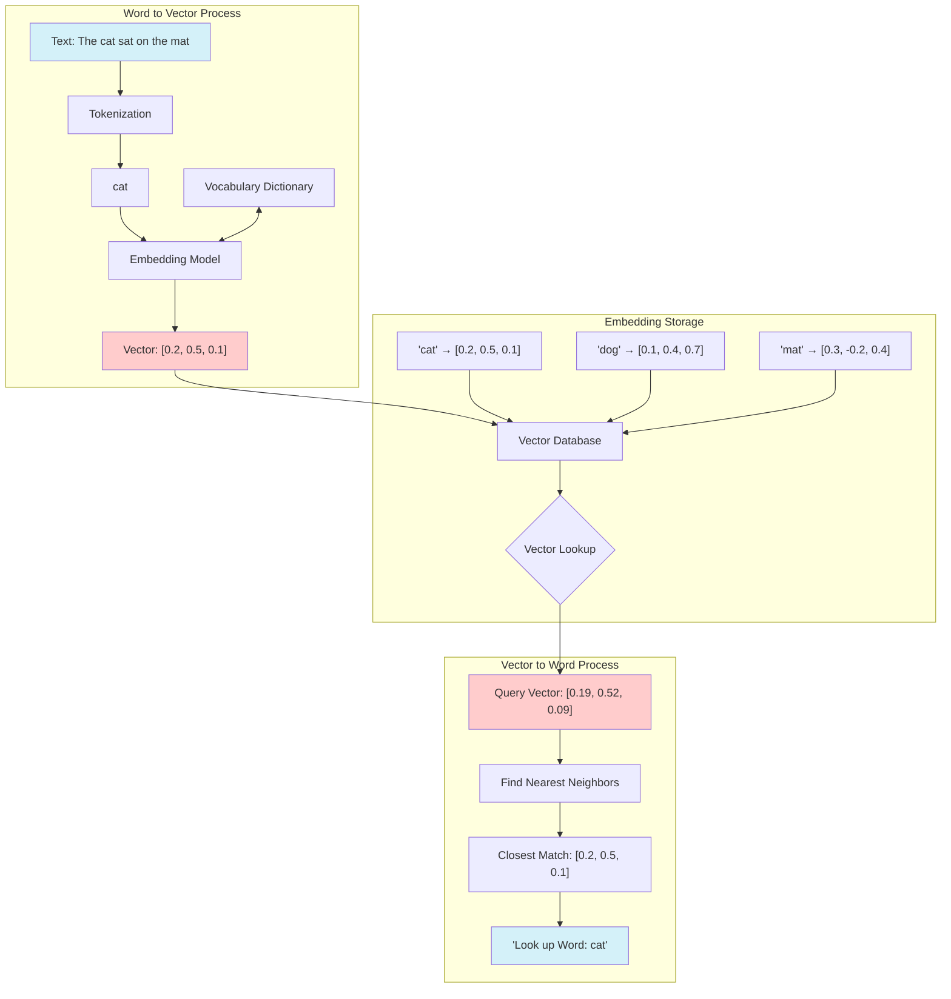
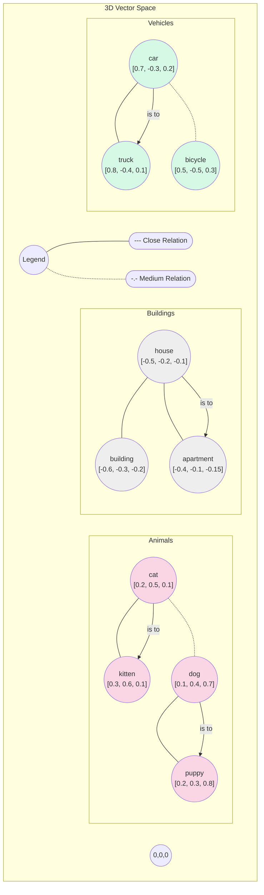

```mermaid
flowchart TD
    subgraph "Word to Vector Process"
        A[Text: The cat sat on the mat] --> B[Tokenization]
        B --> C["cat"]
        
        C --> D[Embedding Model]
        D --> E["Vector: [0.2, 0.5, 0.1]"]
        
        F[Vocabulary Dictionary] <--> D
    end
    
    subgraph "Embedding Storage"
        E --> G[Vector Database]
        G --> H{Vector Lookup}
        
        I["'cat' → [0.2, 0.5, 0.1]"] --> G
        J["'dog' → [0.1, 0.4, 0.7]"] --> G
        K["'mat' → [0.3, -0.2, 0.4]"] --> G
    end
    
    subgraph "Vector to Word Process"
        H --> L["Query Vector: [0.19, 0.52, 0.09]"]
        L --> M[Find Nearest Neighbors]
        M --> N["Closest Match: [0.2, 0.5, 0.1]"]
        N --> O['Look up Word: cat']
    end
    
    style A fill:#d4f1f9
    style E fill:#ffcccc
    style L fill:#ffcccc
    style O fill:#d4f1f9
```

```mermaid
graph TD
    subgraph "3D Vector Space"
        origin((0,0,0))
        
        %% Semantic clusters
        subgraph "Animals"
            cat(("cat<br/>[0.2, 0.5, 0.1]"))
            kitten(("kitten<br/>[0.3, 0.6, 0.1]"))
            dog(("dog<br/>[0.1, 0.4, 0.7]"))
            puppy(("puppy<br/>[0.2, 0.3, 0.8]"))
        end
        
        subgraph "Buildings"
            house(("house<br/>[-0.5, -0.2, -0.1]"))
            building(("building<br/>[-0.6, -0.3, -0.2]"))
            apartment(("apartment<br/>[-0.4, -0.1, -0.15]"))
        end
        
        subgraph "Vehicles"
            car(("car<br/>[0.7, -0.3, 0.2]"))
            truck(("truck<br/>[0.8, -0.4, 0.1]"))
            bicycle(("bicycle<br/>[0.5, -0.5, 0.3]"))
        end
        
        %% Relationship lines
        cat --- kitten
        cat -.- dog
        dog --- puppy
        house --- building
        house --- apartment
        car --- truck
        car -.- bicycle
        
        %% Semantic vectors (analogies)
        cat -- "is to" --> kitten
        dog -- "is to" --> puppy
        house -- "is to" --> apartment
        car -- "is to" --> truck
        
        %% Legend
        classDef close stroke:#333,stroke-width:1px;
        classDef medium stroke:#888,stroke-dasharray: 5 5;
        
        legend((Legend))
        close_relation(["--- Close Relation"])
        medium_relation(["-.- Medium Relation"])
        
        legend --- close_relation
        legend -.- medium_relation
        
        class cat,kitten,dog,puppy animals;
        class house,building,apartment buildings;
        class car,truck,bicycle vehicles;
        
        %% Distance representations
        classDef animals fill:#f9d5e5,color:#333;
        classDef buildings fill:#eeeeee,color:#333;
        classDef vehicles fill:#d5f9e5,color:#333;
    end
```