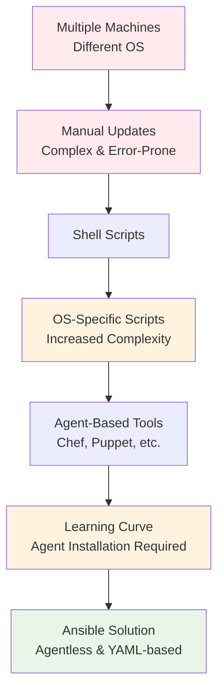
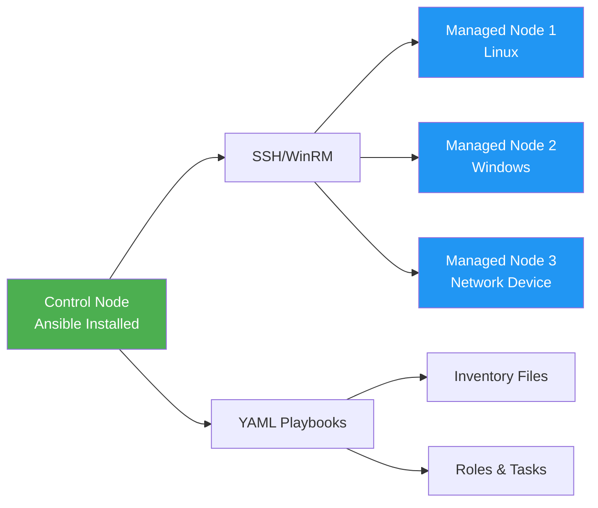
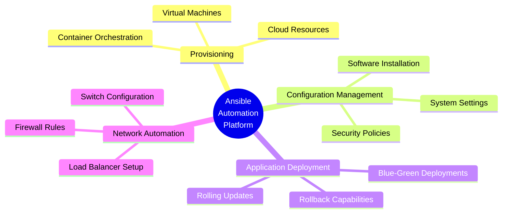
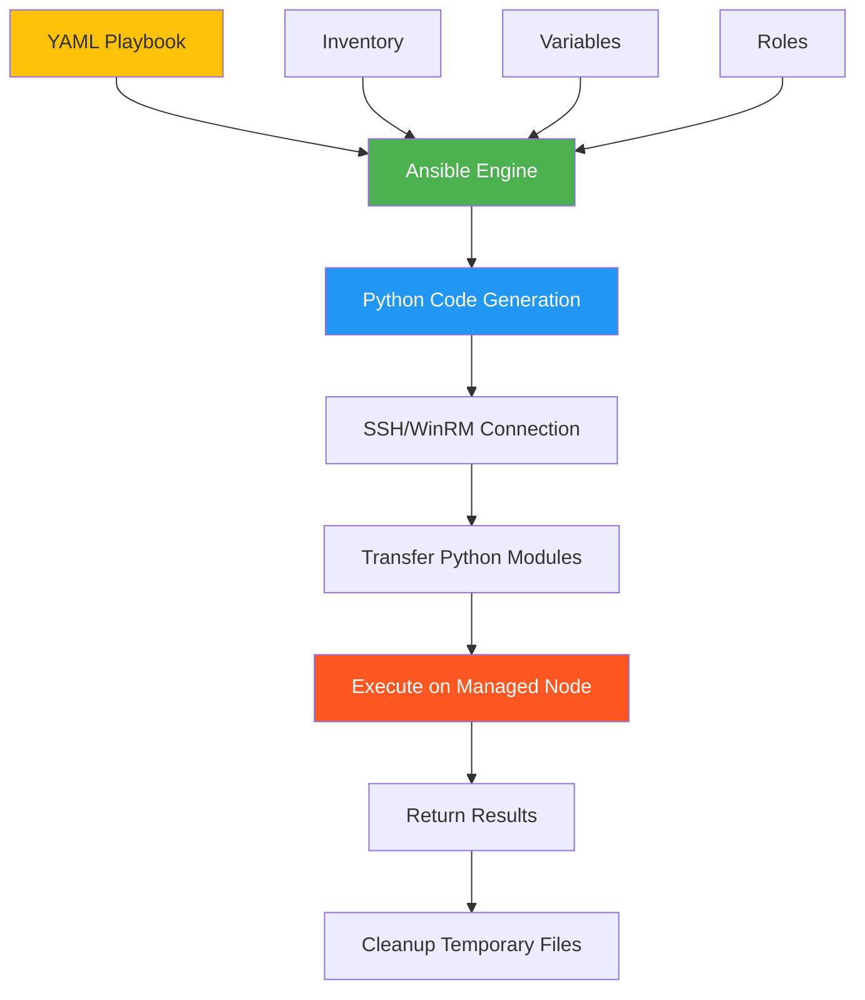

# Ansible: Agentless Infrastructure Automation

## Why Ansible Was Created

Managing infrastructure becomes increasingly complex as organizations scale across multiple machines and operating systems. Let's examine the evolution of configuration management tools and how Ansible addresses these challenges.

#### Evolution of Configuration Management

### The Challenges Before Ansible

**Multi-OS Environment Complexity**: Organizations running heterogeneous infrastructure faced significant hurdles when trying to maintain consistency across different operating systems and machine types.

**Shell Script Limitations**: While shell scripts offered automation, they required OS-specific implementations, leading to maintenance overhead and increased complexity as the number of supported platforms grew.

**Agent-Based Tool Drawbacks**: Traditional configuration management tools like Chef and Puppet introduced their own challenges:
- Steep learning curves with domain-specific languages
- Requirement for agent installation on every managed machine
- Additional overhead for agent maintenance and updates

## Ansible's Solution

Ansible revolutionized infrastructure automation by introducing an **agentless architecture** with **human-readable YAML configuration**.

#### Ansible Architecture Diagram

## What Ansible Has Become

Ansible has evolved from a simple configuration management tool into a comprehensive automation platform supporting multiple use cases:

#### Ansible's Automation Capabilities

## How Ansible Works

Ansible's execution model transforms human-readable YAML into actionable Python code that executes on target systems:

#### Ansible Execution Flow

### Key Advantages

**Agentless Design**: No software installation required on managed nodes - only SSH (Linux/Unix) or WinRM (Windows) connectivity is needed.

**YAML Simplicity**: Configuration written in human-readable YAML format, making it accessible to both developers and system administrators.

**Idempotent Operations**: Tasks can be run multiple times safely, ensuring systems reach the desired state without unintended side effects.

**Extensive Module Library**: Thousands of built-in modules for managing everything from cloud resources to network devices.

**Push-Based Model**: Changes are pushed from the control node to managed nodes on-demand, providing immediate feedback and control.

Ansible's evolution from a configuration management tool to a comprehensive automation platform has made it an essential component in modern DevOps and infrastructure management practices.