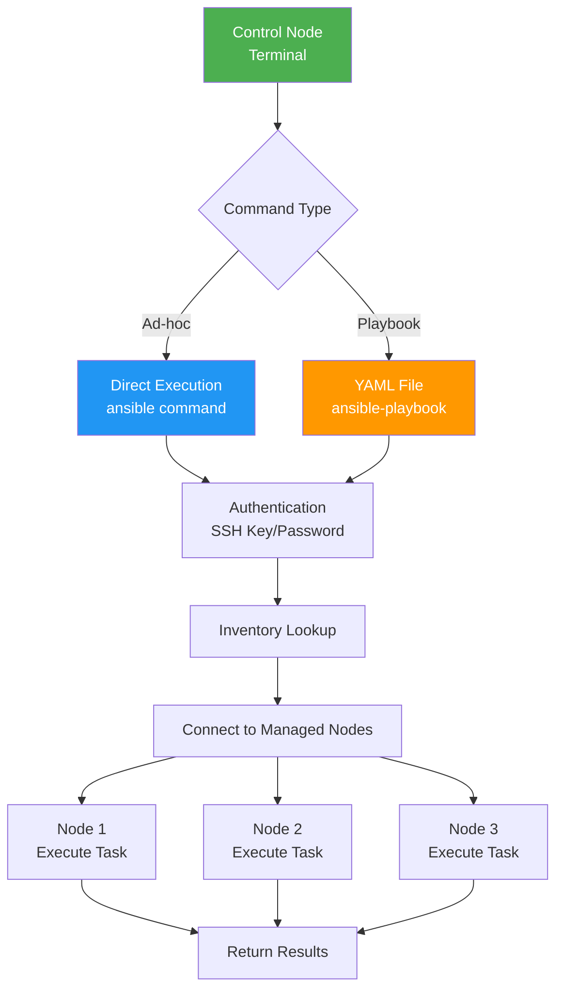
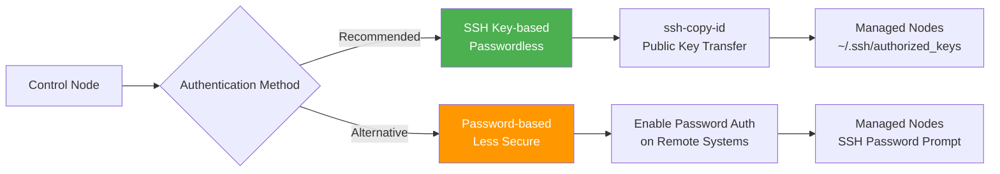
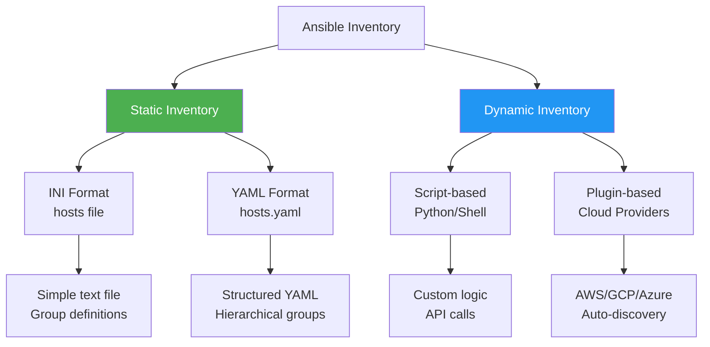
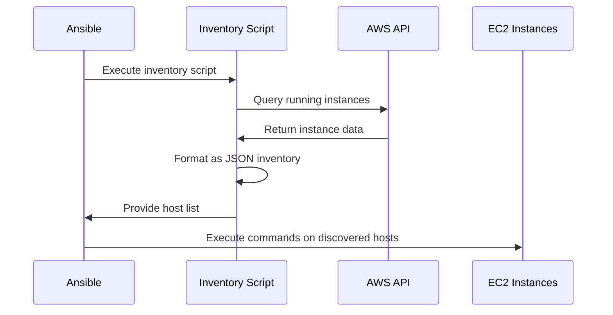
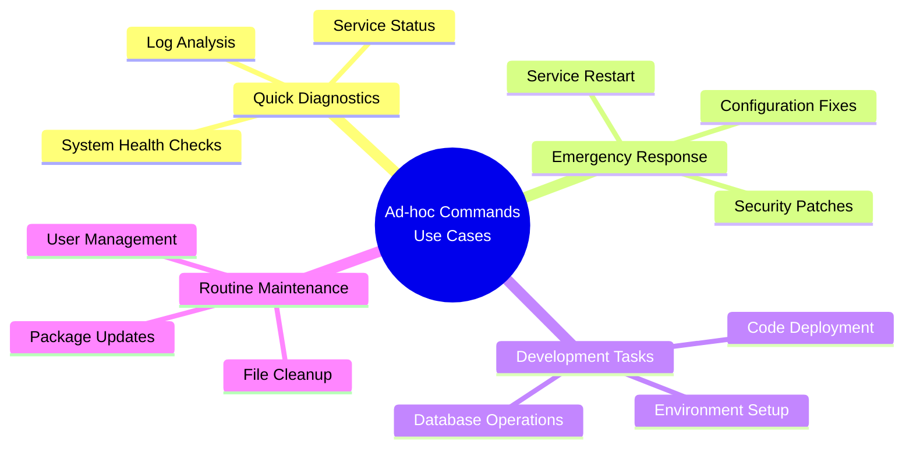

# Ansible Ad-hoc Commands: Quick Infrastructure Management

- https://medium.com/@saurabhdahibhate50/mastering-ad-hoc-commands-in-ansible-a-comprehensive-guide-506e81dcd9b2
- https://docs.ansible.com/ansible/latest/command_guide/intro_adhoc.html

This guide covers the essential components needed to execute Ansible ad-hoc commands effectively, from authentication setup to inventory management and practical command examples.

## What Are Ad-hoc Commands?

Ad-hoc commands are one-time Ansible commands executed directly from the terminal without writing playbooks. They're perfect for quick administrative tasks, system checks, and immediate configuration changes.## 1. Passwordless Authentication Setup

Before executing any Ansible commands, you must establish secure authentication between the control node and managed nodes.

#### Ansible Command Execution Flow


### Authentication Methods

#### Ansible Authentication Methods


### SSH Key Setup for EC2 Instances

For AWS EC2 instances with existing PEM files:

```bash
ssh-copy-id -f "-o IdentityFile <PATH_TO_PEM_FILE>" ubuntu@<INSTANCE_PUBLIC_IP>
```

**Command Breakdown:**
- `ssh-copy-id`: Copies your public key to the remote machine
- `-f`: Forces key copying (overwrites existing keys)
- `"-o IdentityFile <PATH_TO_PEM_FILE>"`: Specifies the private key file to use
- `ubuntu@<INSTANCE_PUBLIC_IP>`: Target username and IP address

### Password Authentication Setup

For password-based authentication (less secure, not recommended for production):

1. **Edit SSH configuration:**
   ```bash
   sudo nano /etc/ssh/sshd_config.d/60-cloudimg-settings.conf
   ```

2. **Enable password authentication:**
   ```
   PasswordAuthentication yes
   ```

3. **Restart SSH service:**
   ```bash
   sudo systemctl restart ssh

   sudo passwd ubuntu
   ssh-copy-id ubuntu@YOUR-IP

   ssh ubuntu@YOUR-IP
   ```

## 2. Ansible Inventory Management

The inventory file defines which hosts Ansible will manage and organizes them into logical groups.

#### Ansible Inventory Types


### Static Inventory Examples

**INI Format (`hosts`):**
```ini
[webservers]
web1.example.com
web2.example.com

[dbservers]
db1.example.com
db2.example.com

[all:vars]
ansible_user=admin
ansible_ssh_private_key_file=/path/to/key
```

**YAML Format (`hosts.yaml`):**
```yaml
all:
  vars:
    ansible_user: admin
    ansible_ssh_private_key_file: /path/to/key
  children:
    webservers:
      hosts:
        web1.example.com:
        web2.example.com:
    dbservers:
      hosts:
        db1.example.com:
        db2.example.com:
```

### Dynamic Inventory for AWS EC2

Dynamic inventories automatically discover and manage cloud resources:

#### Dynamic Inventory Process


## 3. Common Ad-hoc Command Examples

```ini
ubuntu@52.32.45.238
ubuntu@34.208.143.10
```

Ansible ad-hoc commands are single-line commands executed from the command line on the Ansible control node to perform quick, one-time tasks on managed nodes without the need for a full playbook. They are particularly useful for immediate actions, troubleshooting, or testing specific modules. 

### Basic Command Structure
```bash
ansible [host-pattern] -i [inventory] -m [module_name] -a [module_arguments]
```

`ansible`:
The base command for executing Ansible.

`<host-pattern>`:
Specifies the target hosts or groups from your inventory on which the command will run (e.g., all, webservers, host1).

`-m <module_name>`:
Specifies the Ansible module to be used (e.g., ping, shell, command, apt, yum, copy).

`-a "<module_arguments>"`:
Provides arguments or parameters for the chosen module, enclosed in double quotes.

```bash
# Ping all hosts.
ansible all -m ping

# Run a shell command on a specific host
ansible webserver1 -m shell -a "uptime"

# Copy a file to multiple hosts.
ansible all -m copy -a "src=/tmp/local_file.txt dest=/home/user/remote_file.txt"

ansible -i inventory/inventory.ini -m ping all
ansible -i inventory/inventory.ini -m shell -a "sudo apt update && sudo apt install nginx -y" all
ansible -i inventory/inventory.ini -m ping ubuntu@52.32.45.238

# list files using sudo 
ansible all -i inventory/inventory.ini -b -m shell -a 'ls /etc'
```

```ini
[app]
ubuntu@52.32.45.238

[db]
ubuntu@34.208.143.10
```

```bash
ansible -i inventory/inventory.ini -m ping app

ansible -i inventory/inventory.ini -m ping db
```

### To run a shell command with sudo on all hosts in an inventory file

```bash
ansible -i <inventory_file> all -b -m shell -a '<sudo-command>'
```

This command uses the -b option to become the sudo user before executing the command with the shell module. Replace command with the command you want to run as sudo.

`-b` or (`--become`): This tells Ansible to run the command as the superuser (i.e., with sudo).


### System Management Tasks

**Check system uptime:**
```bash
ansible all -i inventory -m command -a "uptime"
```

**Install packages:**
```bash
ansible all -b -i inventory/inventory.ini -m apt -a 'name=nginx state=present' --become
```

**To check the status of a specific service on all hosts in an inventory file**

```bash
ansible all -b -i inventory/inventory.ini -m service -a 'name=nginx state=started'
```

**Restart services:**
```bash
ansible all -i inventory -m service -a "name=nginx state=restarted" --become
```

**Copy files:**
```bash
ansible all -i inventory -m copy -a "src=/local/file dest=/remote/path"
```

**Gather system facts:**
```bash
ansible all -i inventory -m setup
```

**Check disk space:**
```bash
ansible all -i inventory -m shell -a "df -h"
```

### Advanced Examples

**Update all packages:**
```bash
ansible all -i inventory -m apt -a "update_cache=yes upgrade=dist" --become
```

**Create users:**
```bash
ansible all -i inventory -m user -a "name=newuser state=present" --become
```

**Set file permissions:**
```bash
ansible all -i inventory -m file -a "path=/etc/hosts mode=644" --become
```

## 4. Power of Ad-hoc Commands

Ad-hoc commands excel in several scenarios:

#### Ad-hoc commands Use Cases


### Benefits Over Traditional Approaches

**Parallel Execution**: Commands run simultaneously across all target hosts, dramatically reducing execution time compared to sequential SSH connections.

**Consistent Results**: Identical commands execute on all systems, ensuring uniform configuration and reducing human error.

**Immediate Feedback**: Real-time output shows success or failure status for each host, enabling quick identification of issues.

**No Agent Required**: Direct SSH connections eliminate the need for additional software installation on managed nodes.

## Usage Pattern

All Ansible commands follow this general pattern:

```bash
ansible-playbook -i inventory <playbook.yml>
# OR
ansible [host-pattern] -i inventory -m [module] -a [arguments]
```

The inventory file serves as the foundation for both ad-hoc commands and playbooks, defining the infrastructure landscape that Ansible will manage. Whether using static files for stable environments or dynamic scripts for cloud-based infrastructure, proper inventory management is crucial for effective Ansible automation.