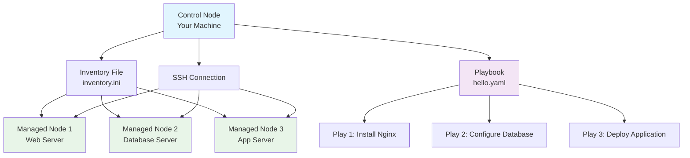
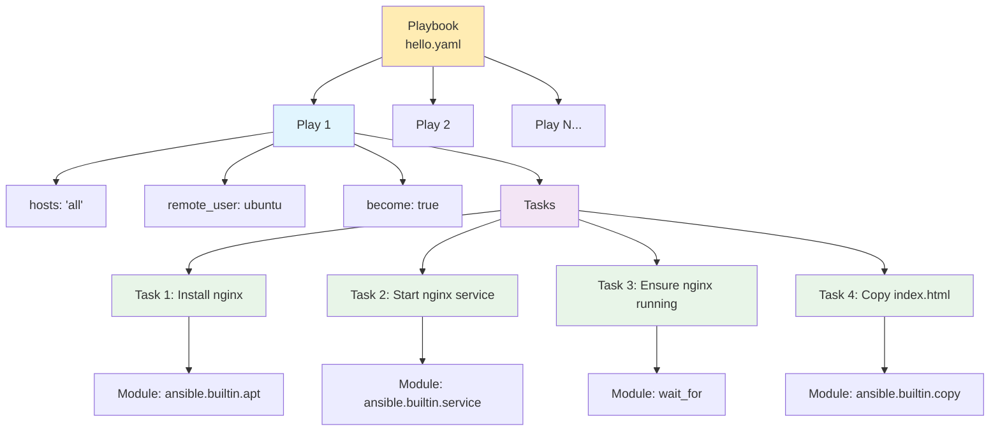
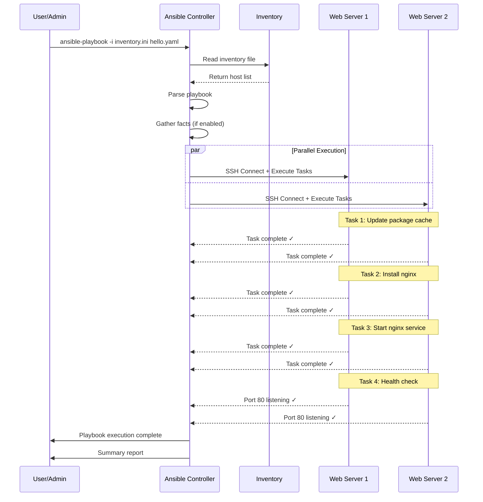

# Ansible Playbooks: Complete Guide for Beginners

Ansible playbooks are automation blueprints written in YAML that define what tasks should be executed on which servers. Think of them as instruction manuals that tell Ansible exactly what to do across your infrastructure.

## Understanding the Architecture

### Ansible Architecture Overview


## What is a Play?

A **play** is a single unit of work in an Ansible playbook. Each play:
- Targets specific hosts (servers)
- Runs as a specific user
- Contains a list of tasks to execute
- Can include variables, handlers, and other components

## Playbook Structure Breakdown



## Enhanced Playbook Example with Explanations

```yaml
---
# Playbook: Web Server Setup
# Description: Installs and configures nginx web server

- name: Setup Web Server                    # Play name (optional but recommended)
  hosts: 'all'                             # Target hosts: 'all', 'webservers', IP addresses
  remote_user: ubuntu                       # SSH user to connect as
  become: true                              # Use sudo/root privileges
  gather_facts: yes                         # Collect system information
  
  vars:                                     # Variables for this play
    nginx_port: 80
    document_root: /var/www/html
    index_file: index.html
  
  tasks:
    - name: Update package cache            # Task 1: Always update package cache first
      ansible.builtin.apt:
        update_cache: yes
        cache_valid_time: 3600             # Cache valid for 1 hour
      tags: 
        - packages
        - setup

    - name: Install nginx web server       # Task 2: Install nginx package
      ansible.builtin.apt:
        name: nginx
        state: present                     # present = install, absent = remove
      notify: restart nginx                # Trigger handler if changed
      tags: 
        - packages
        - nginx

    - name: Start and enable nginx service # Task 3: Manage service state
      ansible.builtin.service:
        name: nginx
        state: started                     # started, stopped, restarted
        enabled: true                      # Start on boot
      tags: 
        - services
        - nginx

    - name: Wait for nginx to be ready     # Task 4: Health check
      wait_for:
        port: "{{ nginx_port }}"          # Use variable
        host: localhost
        delay: 5                          # Wait 5 seconds before checking
        timeout: 30                       # Timeout after 30 seconds
        state: started                    # Port should be listening
      tags: 
        - health-check

    - name: Create custom index page       # Task 5: Create content
      ansible.builtin.copy:
        content: |
          <!DOCTYPE html>
          <html>
          <head>
              <title>Welcome to {{ inventory_hostname }}</title>
          </head>
          <body>
              <h1>Server configured with Ansible!</h1>
              <p>Hostname: {{ inventory_hostname }}</p>
              <p>Date: {{ ansible_date_time.date }}</p>
          </body>
          </html>
        dest: "{{ document_root }}/{{ index_file }}"
        owner: www-data
        group: www-data
        mode: '0644'                      # File permissions
        backup: yes                       # Create backup of existing file
      tags: 
        - content
        - web

    - name: Configure nginx virtual host   # Task 6: Advanced configuration
      ansible.builtin.template:
        src: nginx-site.conf.j2           # Jinja2 template file
        dest: /etc/nginx/sites-available/default
        backup: yes
      notify: restart nginx
      tags: 
        - configuration
        - nginx

    - name: Test nginx configuration       # Task 7: Validate config
      ansible.builtin.command:
        cmd: nginx -t                     # Test nginx config syntax
      changed_when: false                 # Don't report as changed
      tags: 
        - validation

  handlers:                               # Handlers run when notified
    - name: restart nginx
      ansible.builtin.service:
        name: nginx
        state: restarted

  post_tasks:                            # Run after all tasks
    - name: Display access information
      debug:
        msg: 
          - "Nginx is now running on all targeted hosts"
          - "Access your web server at: http://{{ inventory_hostname }}"
          - "Configuration completed successfully!"

# Second play example - Database setup
- name: Setup Database Server
  hosts: database_servers               # Different host group
  remote_user: ubuntu
  become: true
  
  vars:
    mysql_root_password: "SecurePass123"
    database_name: "webapp_db"
  
  tasks:
    - name: Install MySQL server
      ansible.builtin.apt:
        name: 
          - mysql-server
          - python3-pymysql              # Required for MySQL modules
        state: present
      tags: database

    - name: Secure MySQL installation
      mysql_user:
        name: root
        password: "{{ mysql_root_password }}"
        login_unix_socket: /var/run/mysqld/mysqld.sock
      tags: database

    - name: Create application database
      mysql_db:
        name: "{{ database_name }}"
        state: present
        login_user: root
        login_password: "{{ mysql_root_password }}"
      tags: database
```

## Key Components Explained

### 1. **Play Directives**
- `hosts`: Defines target servers (can be 'all', group names, or specific IPs)
- `remote_user`: SSH username for connection
- `become`: Escalate privileges (sudo/root access)
- `gather_facts`: Collect system information before tasks run

### 2. **Tasks**
Tasks are the actual work units. Each task uses an Ansible **module** to perform specific actions:
- `apt`: Package management for Debian/Ubuntu
- `service`: Manage system services
- `copy`: Copy files to remote hosts
- `template`: Process Jinja2 templates
- `wait_for`: Wait for conditions to be met

### 3. **Variables**
Store reusable values that can be referenced throughout the playbook using `{{ variable_name }}` syntax.

### 4. **Handlers**
Special tasks that only run when triggered by other tasks using the `notify` directive.

## Execution Flow


## Running Ansible Playbooks

### Basic Command Structure
```bash
ansible-playbook -i inventory_file playbook.yaml
```

### Common Options
```bash
# Basic execution
ansible-playbook -i inventory/inventory.ini playbooks/hello.yaml

# Check mode (dry run) - see what would change
ansible-playbook -i inventory.ini hello.yaml --check

# Step-by-step execution with prompts
ansible-playbook -i inventory.ini hello.yaml --step

# Run specific tags only
ansible-playbook -i inventory.ini hello.yaml --tags "nginx,packages"

# Skip specific tags
ansible-playbook -i inventory.ini hello.yaml --skip-tags "health-check"

# Increase verbosity for debugging
ansible-playbook -i inventory.ini hello.yaml -v    # verbose
ansible-playbook -i inventory.ini hello.yaml -vvv  # very verbose

# Limit to specific hosts
ansible-playbook -i inventory.ini hello.yaml --limit "webserver1,webserver2"

# Override variables
ansible-playbook -i inventory.ini hello.yaml -e "nginx_port=8080"
```

## Inventory File Structure

```ini
# inventory/inventory.ini

# Individual hosts
web1 ansible_host=192.168.1.10 ansible_user=ubuntu
web2 ansible_host=192.168.1.11 ansible_user=ubuntu
db1 ansible_host=192.168.1.20 ansible_user=ubuntu

# Host groups
[webservers]
web1
web2
web3 ansible_host=192.168.1.12

[database_servers]
db1
db2 ansible_host=192.168.1.21 ansible_user=admin

[production]
web1
db1

[staging]
web2
web3
db2

# Group variables
[webservers:vars]
nginx_port=80
document_root=/var/www/html

[database_servers:vars]
mysql_port=3306
mysql_root_password=SecurePassword123

# Variables for all hosts
[all:vars]
ansible_ssh_private_key_file=~/.ssh/ansible_key
ansible_ssh_common_args='-o StrictHostKeyChecking=no'
```

## Best Practices for Beginners

### 1. **Start Small**
Begin with simple tasks like installing packages or copying files before attempting complex configurations.

### 2. **Use Check Mode**
Always test with `--check` flag first to see what would change without actually making changes.

### 3. **Implement Idempotency**
Ensure your tasks can be run multiple times without causing issues. Ansible modules are generally idempotent by default.

### 4. **Use Meaningful Names**
Give descriptive names to your plays and tasks for better readability and debugging.

### 5. **Leverage Tags**
Use tags to run specific parts of your playbook during development and maintenance.

### 6. **Handle Errors Gracefully**
```yaml
- name: Attempt risky operation
  command: /path/to/risky-command
  ignore_errors: yes
  
- name: Operation with custom error handling
  command: /path/to/command
  register: result
  failed_when: result.rc != 0 and "expected error" not in result.stderr
```

## Common Task Patterns

```yaml
# Package Management
- name: Install multiple packages
  ansible.builtin.apt:
    name:
      - nginx
      - mysql-server
      - python3-pip
    state: present
    update_cache: yes

# File Operations
- name: Create directory with specific permissions
  ansible.builtin.file:
    path: /opt/myapp
    state: directory
    owner: www-data
    group: www-data
    mode: '0755'

# Template Processing
- name: Generate configuration from template
  ansible.builtin.template:
    src: nginx.conf.j2
    dest: /etc/nginx/nginx.conf
    backup: yes
  notify: restart nginx

# Conditional Tasks
- name: Install Docker on Ubuntu
  ansible.builtin.apt:
    name: docker.io
    state: present
  when: ansible_distribution == "Ubuntu"

# Loop Through Items
- name: Create multiple users
  ansible.builtin.user:
    name: "{{ item }}"
    state: present
    groups: sudo
  loop:
    - alice
    - bob
    - charlie

# Register and Use Results
- name: Check if service exists
  ansible.builtin.stat:
    path: /etc/systemd/system/myservice.service
  register: service_file

- name: Start service if it exists
  ansible.builtin.service:
    name: myservice
    state: started
  when: service_file.stat.exists

# Block for Error Handling
- block:
    - name: Risky operation
      command: /path/to/risky-command
    - name: Another risky operation
      command: /path/to/another-command
  rescue:
    - name: Handle error
      debug:
        msg: "Something went wrong, but we're handling it"
  always:
    - name: Always run this
      debug:
        msg: "This runs regardless of success or failure"
```
This guide covers the fundamentals of Ansible playbooks. Start with simple tasks, use check mode frequently, and gradually build more complex automation as you become comfortable with the concepts. The key is understanding that playbooks are just structured lists of instructions that Ansible executes across your infrastructure in a predictable, repeatable way.