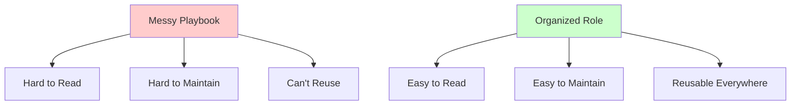
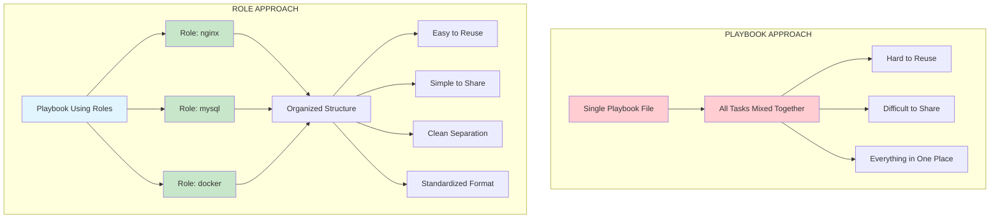
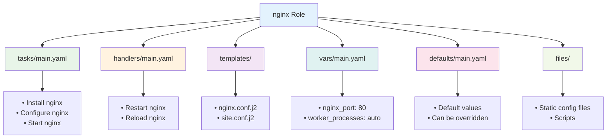
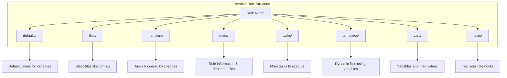
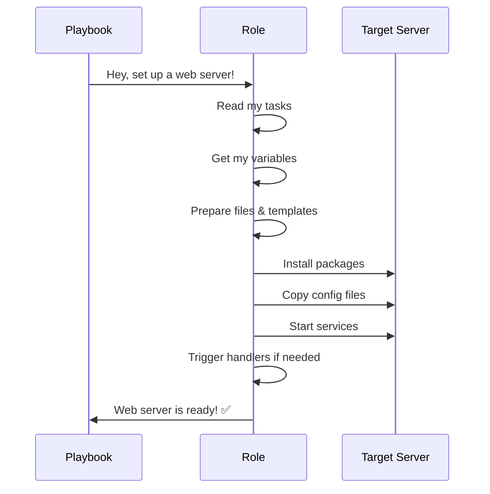
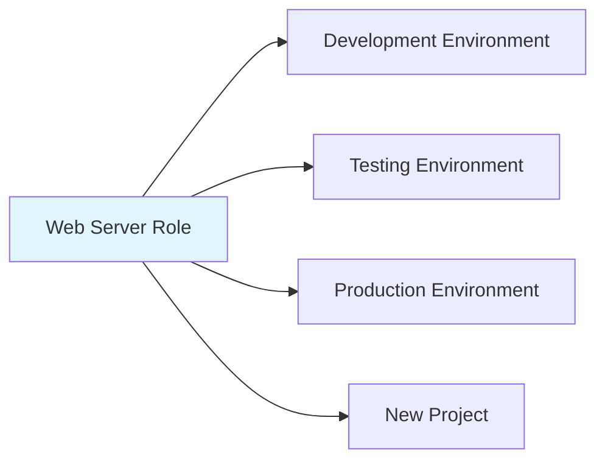
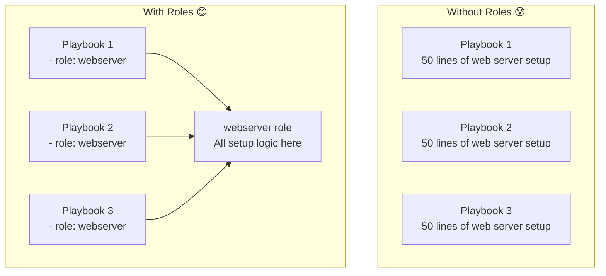

# Ansible Roles - Beginner's Guide

- https://galaxy.ansible.com/ui/

## What is an Ansible Role? 🎭

Think of an Ansible Role like a **recipe book for your computer setup**. Just like how you organize recipes by categories (appetizers, main dishes, desserts), Ansible roles organize your automation tasks into neat, reusable packages.

Instead of writing the same setup instructions over and over again, you create a role once and use it everywhere!

## The Magic of Organization 📁

Ansible roles don't do magic - they just organize your code **really well**. It's like having a well-organized toolbox where everything has its place.



## Creating Your First Role 🚀

To create a new role, use this simple command:

```bash
ansible-galaxy role init my_web_server
```

This creates a folder structure that looks like this:

```
my_web_server/
├── defaults/     ← Default settings
├── files/        ← Static files (like config files)
├── handlers/     ← Special tasks that run when needed
├── meta/         ← Information about this role
├── tasks/        ← The main work happens here
├── templates/    ← Dynamic files (can change based on variables)
├── tests/        ← Test your role
└── vars/         ← Variables and their values
```

## Playbook vs Role





## Role Directory Structure Explained 🏗️



### Let's Break It Down Simple:

**📝 tasks/** - This is where the main work happens
- Contains the step-by-step instructions
- Like: "install nginx", "start the service", "copy config file"

**⚙️ defaults/** - Default settings that can be changed
- Like having default toppings for a pizza, but customers can change them

**📄 files/** - Static files that never change
- Like a company logo or a standard config file

**🎨 templates/** - Dynamic files that change based on situations
- Like a form letter where you fill in different names and addresses

**🔄 handlers/** - Special tasks that only run when something changes
- Like restarting a web server only after you change its config

**📊 vars/** - Variables and their specific values
- Like storing the web server port number or database password

**ℹ️ meta/** - Information about your role
- Like an ingredient list and cooking time on a recipe

## How Roles Work in Action 🎬



## Why Use Roles? (The Benefits) 🌟

### 1. **Reusability** ♻️
Write once, use everywhere! Like having a master recipe you can use for different occasions.



### 2. **Organization** 📚
Everything has its place, making it easy to find and fix things.

### 3. **Team Collaboration** 👥
Different people can work on different roles without stepping on each other's toes.

### 4. **Easy Maintenance** 🔧
Fix a bug once in the role, and it's fixed everywhere you use it.

### 5. **Consistency** 🎯
The same setup process happens the same way every time.

## Real-World Example 🌍

Imagine you're setting up web servers for your company:

**Without Roles:**
- Write the same 50 lines of code in every playbook
- Copy-paste configuration everywhere
- When something breaks, fix it in 10 different places

**With Roles:**
- Create one "webserver" role with all the setup
- Use that role in any playbook with just one line: `- role: webserver`
- Fix issues once, benefit everywhere



## Quick Start Checklist ✅

1. **Create a role**: `ansible-galaxy role init my_role_name`
2. **Add your tasks** to `tasks/main.yml`
3. **Set default values** in `defaults/main.yml`
4. **Add any files** you need to copy in the `files/` folder
5. **Use your role** in a playbook:
   ```yaml
   - hosts: servers
     roles:
       - my_role_name
   ```

## Pro Tips for Beginners 💡

- **Start small**: Begin with a simple role that does one thing well
- **Use descriptive names**: `webserver` is better than `role1`
- **Test your roles**: Always test in a safe environment first
- **Share and reuse**: Check [Ansible Galaxy](https://galaxy.ansible.com/ui/) for existing roles before creating your own
- **Document everything**: Future you will thank present you!

---

**Remember**: Roles are just a way to organize your Ansible code. They make your life easier by keeping things tidy and reusable! 🎉